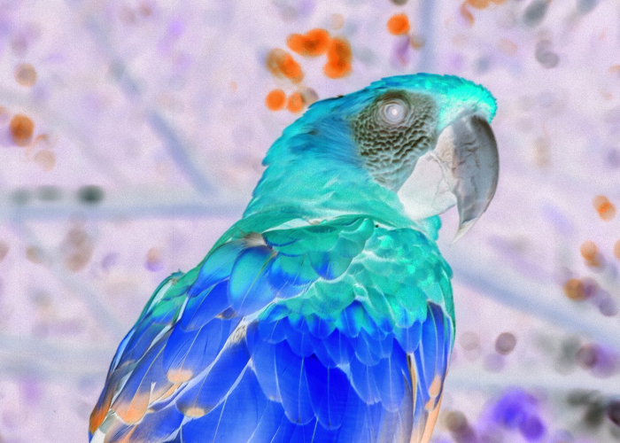
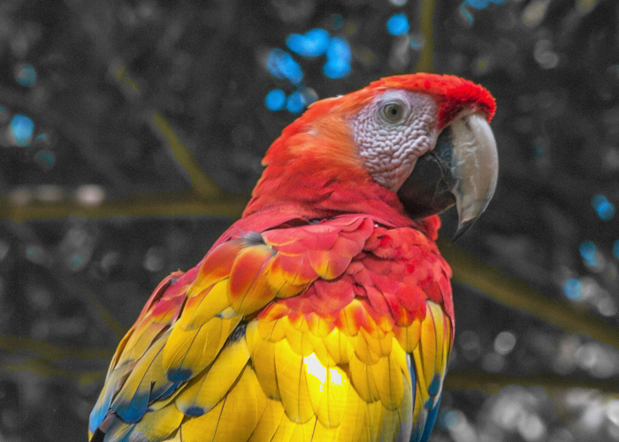
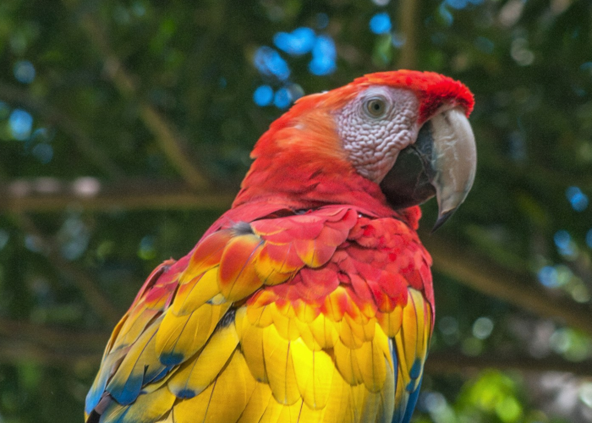
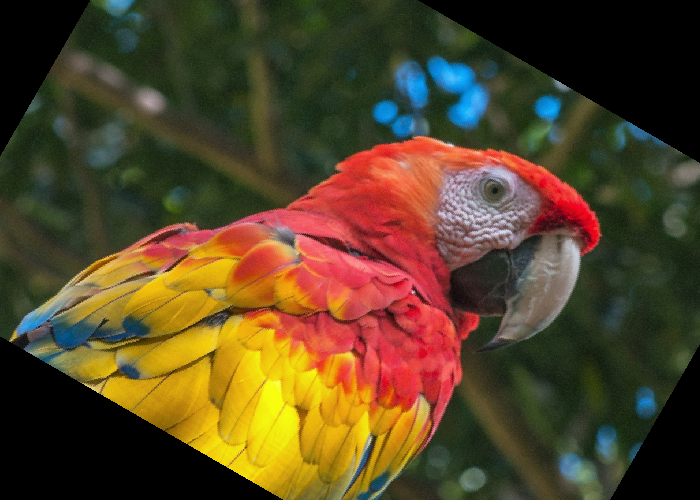
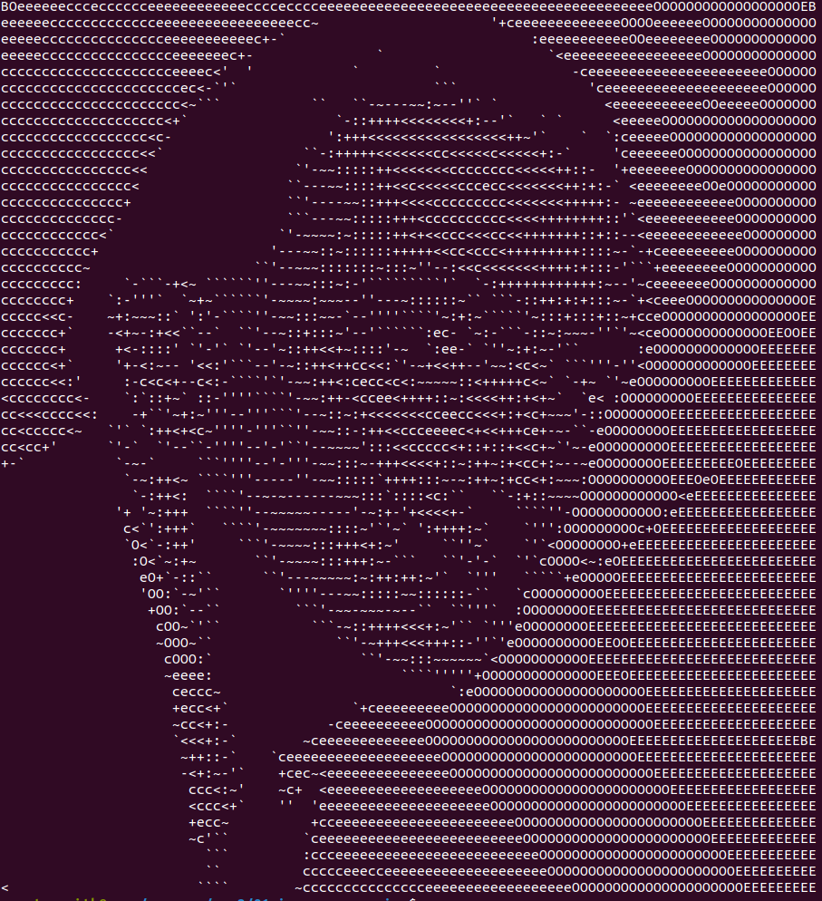
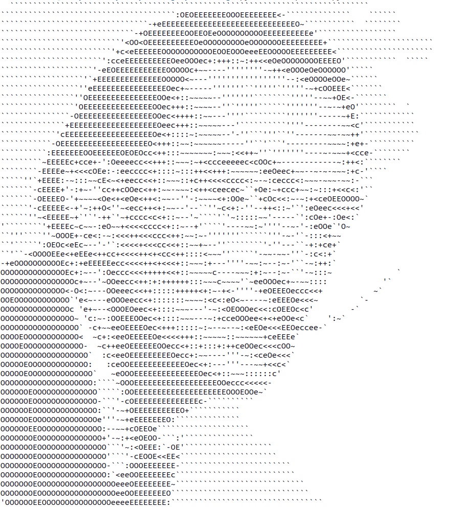

# Image Processing

## Image Coordinates


- Zero-indexed
- [Top-left origin](https://dsp.stackexchange.com/questions/35925/why-do-we-use-the-top-left-corner-as-the-origin-in-image-processing)

## Pixels


## Subpixels


## Color Channels

- `(r, g, b)` notation
- https://rgbcolorpicker.com/

## Color Intuition


## Impossible Colors


## Colors Worksheet


## PIL / Pillow

https://pillow.readthedocs.io/en/stable/reference/Image.html

```py
from PIL import Image

# Load input image
im = Image.open("bird.png")

print(im.width)
print(im.height)
print(im.getpixel((0, 0)))
```

```
700
500
(45, 70, 31)
```

---

```py
from PIL import Image

# Load input image
im = Image.open("bird.png")

for y in range(2):
    for x in range(2):
        color = im.getpixel((x, y))
        print(color)
```

```
(45, 70, 31)
(45, 65, 28)
(46, 71, 32)
(42, 62, 26)
```

## Tuples

```py
(r, g, b) = im.getpixel((x, y))
```

## Output

```py
from PIL import Image

# Load input image
im = Image.open("bird.png")

# Make blank output image with same dimension as the original
output = Image.new(im.mode, (im.width, im.height))

for y in range(im.height):
    for x in range(im.width):
        (r, g, b) = im.getpixel((x, y))

        # Your code goes here

        output.putpixel((x, y), (r, g, b))

# Save output image
output.save("output.png")
```

## Max Red Demo

```py
r = 255
```

## Simple Grayscale


- https://en.wikipedia.org/wiki/Grayscale
- `r`, `g`, and `b` are all equal
- $$l = \frac{r + g + b}{3}$$

## Black and White


- Black `(0, 0, 0)`
- White `(255, 255, 255)`

## Better Grayscale


- Relative / perceptual luminance
- https://brandonrohrer.com/convert_rgb_to_grayscale.html

Linear approximation for gamma-compressed channel values:

$$l = 0.299 \cdot r + 0.587 \cdot g + 0.114 \cdot b$$

## Inverted





## Greenish




## Scaled




`700 x 500 -> 1400 x 1000`

## Rotated




## ASCII




```py
symbols = "   ``'-~:+<ceOEB"
```

---




<!-- rotated
kernel
dither
palette
clustering
 -->
